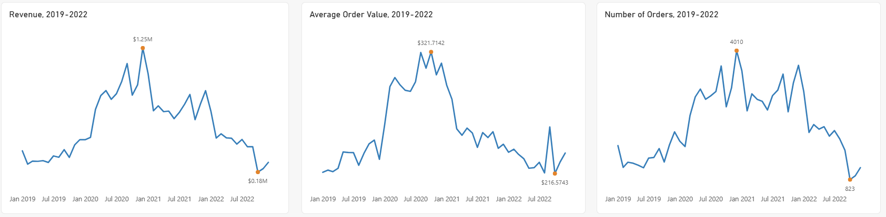
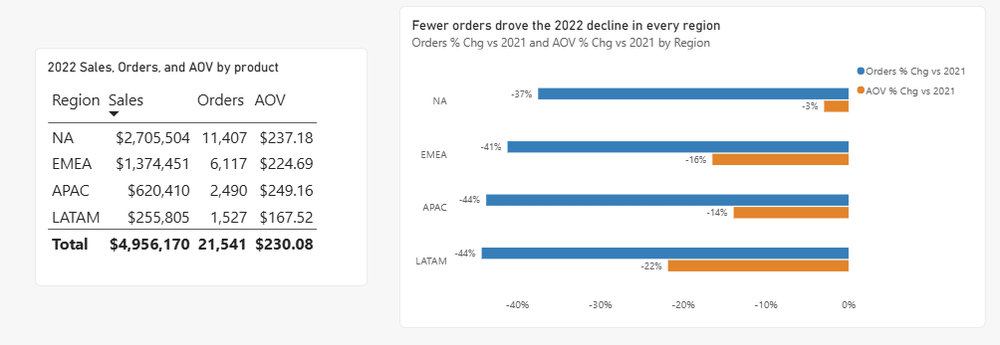
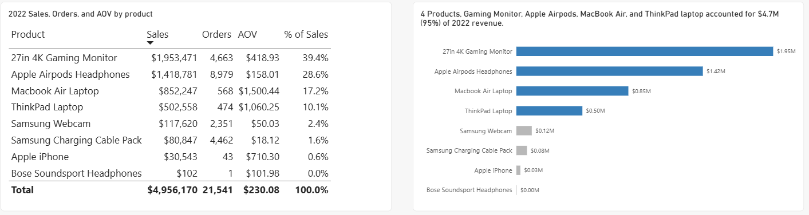
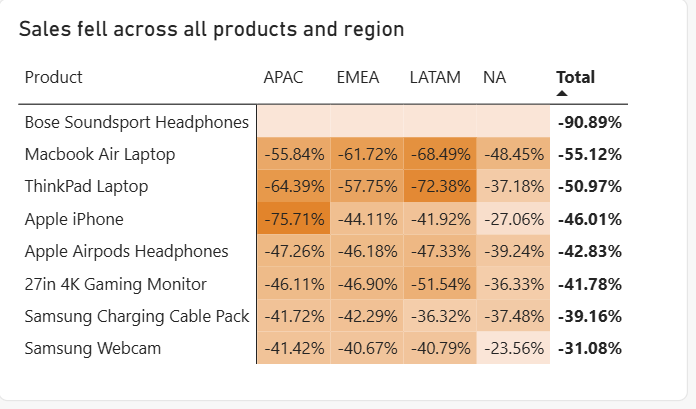
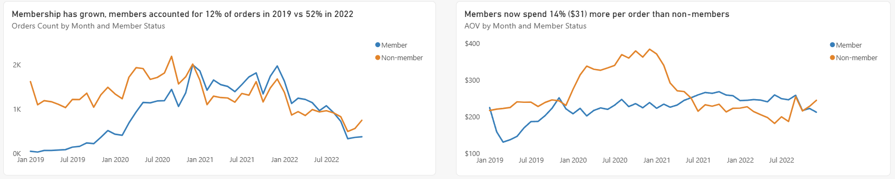

# Kobalt Tech Trend Analysis (2019-2022)

## Table of Contents
- [Project Overview](#project-overview)
- [Executive Summary](#executive-summary)
- [2022 Insights Drill Down](#2022-insights-drill-down)
- [Recommendations and Next Steps](#recommendations-and-next-steps)

## Project Overview

Founded in 2018 and headquartered in Silicon Valley, Kobalt Tech is a leading e-commerce company that sells popular consumer tech products (such as headphones, monitors, and laptops). By using a variety of marketing channels to reach customers, Kobalt Tech has been able to expand to a global customer base. Over the last few years Kobalt has served over 88,000 customers and generated $28M in total sales revenue. Customers can shop the full product catalog through the website and mobile app.

Kobalt Tech has a wealth of data on customers, products, and geographic information that is underutilized. Partnering with the Head of Operations, an analysis was conducted to understand Kobalt Tech's overall trends (2019-2022). The analysis also evaluated product and loyalty program performance from 2022 to guide corporate strategy for the following year.

**Strategic Metrics:** Revenue (Sales), Order count, Average order value (AOV), Loyalty member, Region

## Executive Summary

From 2019-2022 Kobalt Tech saw $28.1M in revenue. Overall sales increased more than 50% during the pandemic and are now stabilizing toward pre-pandemic levels. Since 2020 and 2021 were unique years, this analysis also benchmarks 2022 against 2019.

- **Revenue:** 2022 revenue fell by 46% to $5M, down $4.2M from the prior year. The decline was mainly driven by a 40% (-14,293) decrease in orders.
- **AOV:** AOV fell by $24.67 (10%) in 2022 from the prior year. The decline was across all regions; LATAM had the largest percent decrease at 22%, meaning customers in the region are moving away from expensive products like laptops and monitors.
- **Regions:** At 38%, North America (NA) saw the lowest decline in orders in 2022. However, since NA accounts for more than 50% of orders, it has the largest effect on the decline in revenue.
- **Products:** 4 products account for 96% of revenue: Apple AirPods, Gaming Monitor, MacBook Air, and ThinkPad laptop. Customers order Apple AirPods more than any other product. Every product saw a decline in orders in 2022, with laptops falling the most.
- **Loyalty program:** The loyalty program is strong and growing. Members account for 11,107 (51%) of orders in 2022, up 40% from 2019. Loyalty members have brought in 10% more revenue than non-members ($2.7M vs $2.2M).

## 2022 Insights Drill Down

### 2022 Sales and Region Trends

- Every region saw orders decline by 40%. NA held up best, with orders down 38% and AOV down 3%.
- APAC, EMEA, and NA revenue declines were driven mainly by fewer orders (39%, 52%, and 51% respectively).
- LATAM's sales decline was the steepest, driven by both fewer orders (44%) and lower AOV (22%): customers bought less and purchased less expensive products. However, LATAM's 2022 orders were 76% higher than in 2019, which suggests it is a newly captured market worth protecting.
- Sales have 2 high-traffic seasons each year, August-September (back to school) and December-January (holiday gifting). These are the best windows for promotions.

### Product Performance

- 4 products account for nearly all 2022 revenue: Gaming Monitor (39%), Apple AirPods (29%), MacBook Air (17%), and ThinkPad laptop (10%), totaling $4.7M.
- Orders are concentrated in 3 products: Apple AirPods, Gaming Monitor, and the Samsung charging cable pack.
- Bose SoundSport headphones and Apple iPhone are 2 underperforming products, each accounting for less than 1% of order volume and revenue.
  - Bose headphones saw a total of 1 order in 2022 despite being $56 cheaper than the comparable Apple AirPods, which accounted for 42% of orders.
  - While AirPods is the most-ordered product, the iPhone is the second-lowest, with only $30.1K in sales in 2022.
 
  
  
- Every product declined across all regions in 2022 due to fewer orders, consistent with a post-pandemic shift in customer behavior and more in-store options.
  - MacBook sales fell 55%, with LATAM and EMEA taking the biggest hit.
  - ThinkPad sales fell 51%, with LATAM and APAC taking the biggest hit.
  - AirPods sales fell 43%, consistent across all regions.
  - In LATAM, sales of high-priced products such as the gaming monitor and laptops dropped most sharply.

### Loyalty Program Performance

- The loyalty program has grown rapidly since its inception in 2019. In 2022 members account for 52% of orders, versus only 12% in 2019.
- Since 2021 members bring in more revenue than non-members: 14% more in 2021 ($4.9M vs $4.3M) and 10% more in 2022 ($2.7M vs $2.2M).
- In 2022 members bought more expensive products, with an AOV of $245 per order versus $214 for non-members.
- Members do not consistently spend more per order month over month. In 2022 member AOV surpassed non-members in 10 of 12 months.
- Monthly AOV has declined for both members and non-members, though the decline is less drastic for members.
- Non-member AOV increases in Q4, a potential opportunity to convert holiday shoppers into members.

## Recommendations and Next Steps

### Marketing Team
- **Member conversion:** Run campaigns around peak sales (holiday season and start of school year) focused on the highest-volume products, such as AirPods and the gaming monitor.
- Launch a loyalty sign-up campaign in Q4 to convert non-member holiday shoppers into members.

### Product Team
- Partner with the operations team to investigate low-ticket products like Bose headphones and decide whether they should remain in the catalog.
- Strategize ways to increase loyalty membership. A 20% increase in membership could add an estimated $544K in annual revenue, assuming new members behave like current members.
- Research and test loyalty member incentives aimed at increasing overall AOV.
- Continue to monitor member vs. non-member AOV and orders monthly.

### Operations Team
- Investigate whether the operational and supply chain costs of low-ticket products like Bose headphones are justifiable.
- Research whether customers now favor in-person purchases for high-ticket items like laptops. If so, pilot a partnership with in-person storefronts to display models and ship orders directly to customers.
- Investigate whether distribution or supply chain issues are contributing to LATAM's decline in sales.

